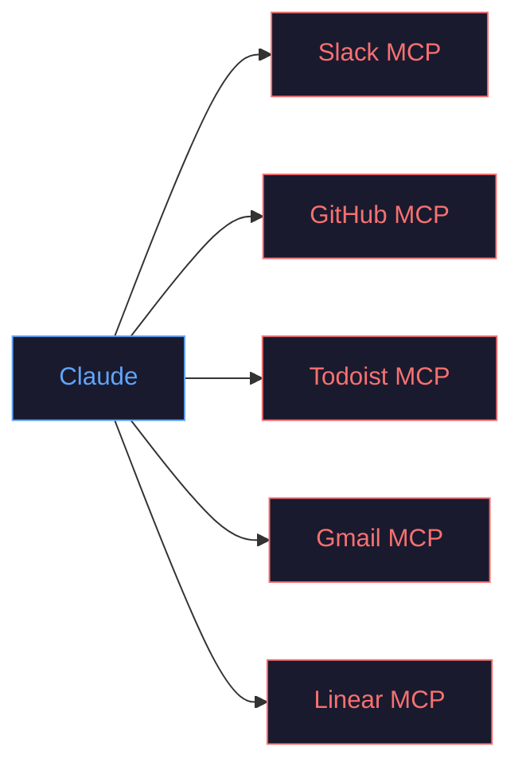
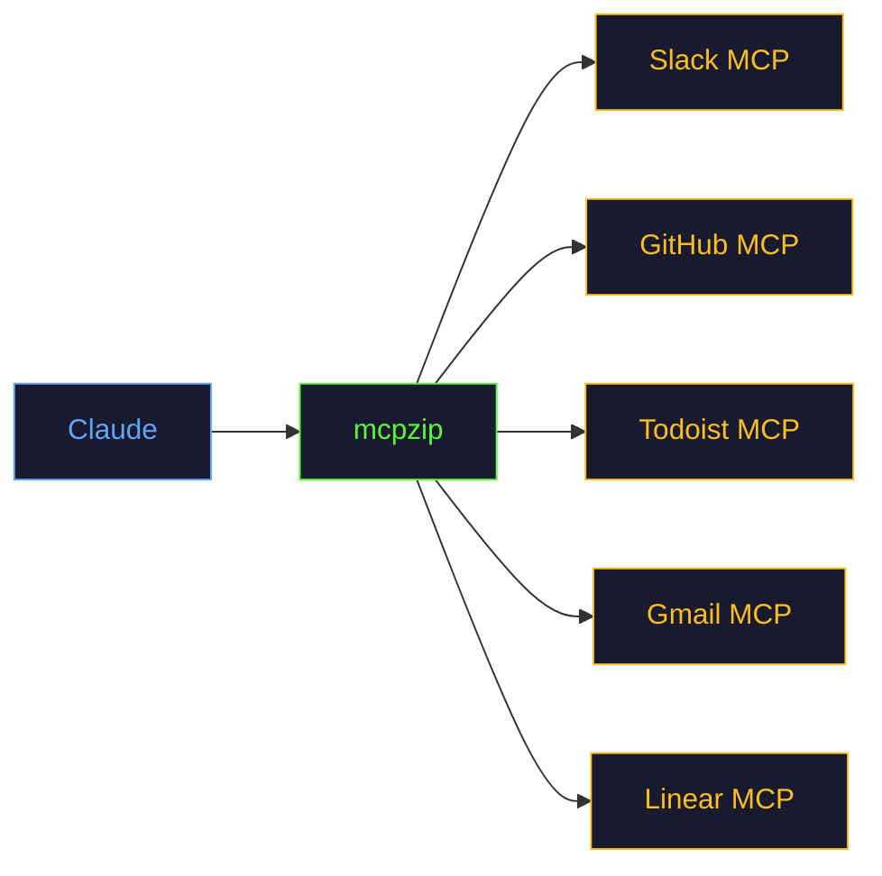

import ComparisonTable from '@site/src/components/ComparisonTable';

# Comparison

How does mcpzip compare to other approaches for managing MCP tools?

## mcpzip vs Raw MCP

The most common setup: every MCP server connected directly to Claude Code.

<ComparisonTable
  headers={["Feature", "Raw MCP", "mcpzip"]}
  rows={[
    ["Tool schemas in context", "All loaded every message", "3 meta-tools only"],
    ["Token overhead (10 servers)", "~87,500", "~1,200"],
    ["Startup time", "Must connect all servers", "Instant (disk cache)"],
    ["Search across servers", false, true],
    ["Connection pooling", false, true],
    ["Idle timeout", false, true],
    ["Background refresh", false, true],
    ["Disk-cached catalog", false, true],
    ["OAuth support", "Per-client", "Centralized with token reuse"],
    ["Adding a new server", "Config each client", "Config once in mcpzip"],
    ["Binary size", "N/A (multiple processes)", "5.8 MB single binary"],
  ]}
/>

### When to Use Raw MCP

- You have 1-2 servers with fewer than 20 tools total
- You need the absolute simplest setup
- You do not care about context overhead

### When to Use mcpzip

- You have 3+ servers
- Your total tool count exceeds 30
- You want faster responses and better tool selection
- You manage multiple accounts (e.g., multiple Gmail accounts)

## Feature-by-Feature

### Context Management

| Approach | How It Works | Pros | Cons |
|----------|-------------|------|------|
| **Raw MCP** | All tool schemas loaded upfront | Simple, no indirection | Context bloat scales linearly |
| **mcpzip** | 3 meta-tools + on-demand search | 99%+ token savings | Extra search step per interaction |
| **Manual tool selection** | Manually enable/disable tools | Full control | Tedious, error-prone |
| **Prompt-based filtering** | System prompt tells model to ignore tools | No proxy needed | Wastes tokens, unreliable |

### Authentication

| Approach | OAuth | API Key | Token Persistence | Token Reuse |
|----------|-------|---------|-------------------|-------------|
| **Raw MCP** | Each client handles it | Per-server config | Client-dependent | No |
| **mcpzip** | Centralized PKCE flow | Via `headers` | Disk-persisted | mcp-remote tokens |
| **mcp-remote** | PKCE flow | No | Disk-persisted | N/A |

### Transport Support

| Approach | stdio | HTTP (Streamable) | SSE (Legacy) | Mixed |
|----------|-------|-------------------|-------------|-------|
| **Raw MCP** | Yes | Client-dependent | Client-dependent | Manual |
| **mcpzip** | Yes | Yes | Yes | Unified config |

## Architecture Comparison

### Raw MCP (Direct Connection)



Claude sees: **125+ tool schemas** (every message)

### With mcpzip



Claude sees: **3 tool schemas** (always)

## The Trade-Off

mcpzip adds one extra roundtrip per tool use (the search step). Here is what you give up and what you gain:

| You Give Up | You Gain |
|-------------|----------|
| Direct tool access (0 extra steps) | 99%+ context savings |
| Simple config (one file) | Search across all servers |
| No proxy overhead | Connection pooling + idle management |
| | Instant startup from cache |
| | Background refresh |
| | Centralized OAuth |
| | Single binary deployment |

:::info The Extra Step Is Cheap
The search step adds ~200-500ms with LLM search, or less than 1ms with keyword search only. Compared to the latency savings from reduced context (fewer tokens to process per message), most users see a **net speed improvement**.
:::

## Migration Path

Moving from raw MCP to mcpzip takes about 60 seconds:

```bash
# 1. Install
cargo install --git https://github.com/hypercall-public/mcpzip

# 2. Migrate (reads your existing Claude Code config)
mcpzip migrate

# 3. Restart Claude Code
# Done!
```

Your existing server configs are preserved. See the [Migration Guide](/docs/migration-guide) for details.
