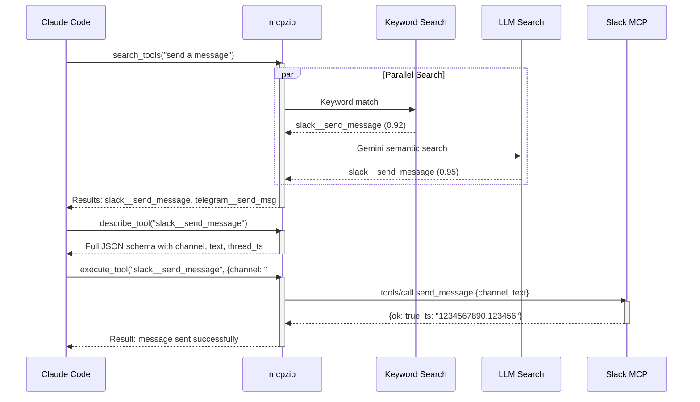
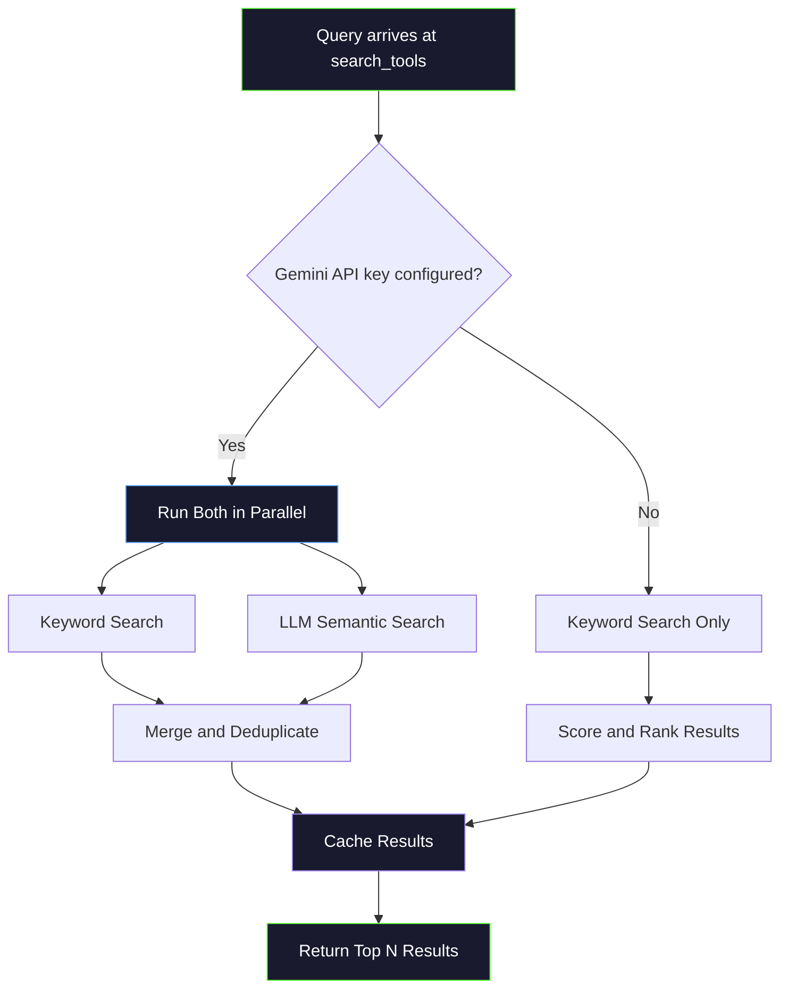

import ArchitectureDiagram from '@site/src/components/ArchitectureDiagram';
import FlowDiagram from '@site/src/components/FlowDiagram';
import ComparisonTable from '@site/src/components/ComparisonTable';
import Tabs from '@theme/Tabs';
import TabItem from '@theme/TabItem';

# How It Works

mcpzip acts like a **receptionist** for your MCP tools. Instead of every tool introducing itself to Claude on every message (flooding the context window), the receptionist directs Claude to exactly the tools it needs, on demand.

## The Three Meta-Tools

Every interaction follows a simple three-step pattern: **Search, Describe, Execute**.

<FlowDiagram steps={[
  { title: "Search", description: "Claude calls search_tools with a natural language query like \"send a message\". mcpzip searches across all upstream servers and returns matching tool names." },
  { title: "Describe (optional)", description: "Claude calls describe_tool to get the full JSON schema for a specific tool. This reveals all parameters, types, and descriptions. Often Claude skips this if the compact search results are sufficient." },
  { title: "Execute", description: "Claude calls execute_tool with the tool name and arguments. mcpzip routes the call to the correct upstream server, waits for the result, and returns it." },
]} />

:::tip Skip the Describe Step
Claude is smart enough to infer parameters from the compact search results in many cases. The `describe_tool` step is optional -- Claude uses it when it needs the full schema for complex tools with many parameters.
:::

## Full Interaction Sequence

Here is what happens when Claude wants to send a Slack message:



## Search Decision Tree

mcpzip uses a two-tier search system. Here is how it decides which path to take:



<details>
<summary><strong>What is MCP?</strong></summary>

The **Model Context Protocol (MCP)** is an open standard that lets AI assistants use external tools. It works like this:

1. An MCP **server** exposes tools (functions the AI can call)
2. An MCP **client** (like Claude Code) connects to the server
3. The client calls `tools/list` to discover available tools
4. The client calls `tools/call` to invoke a specific tool

Each tool has a **JSON Schema** describing its parameters. The problem: every tool schema gets loaded into the AI's context window, consuming tokens on every single message.

Learn more at [spec.modelcontextprotocol.io](https://spec.modelcontextprotocol.io/).

</details>

<details>
<summary><strong>What is a tool schema?</strong></summary>

A tool schema is a JSON document describing a tool's interface. For example, Slack's `send_message` tool might have this schema:

```json
{
  "name": "send_message",
  "description": "Send a message to a Slack channel",
  "inputSchema": {
    "type": "object",
    "properties": {
      "channel": { "type": "string", "description": "Channel ID or name" },
      "text": { "type": "string", "description": "Message text" },
      "thread_ts": { "type": "string", "description": "Thread timestamp for replies" }
    },
    "required": ["channel", "text"]
  }
}
```

A typical tool schema consumes **300-500 tokens**. With 10 servers averaging 25 tools each, that is **75,000-125,000 tokens** loaded on every message -- before the conversation even starts.

</details>

## Before vs After

<ComparisonTable
  headers={["", "Without mcpzip", "With mcpzip"]}
  rows={[
    ["Tools in context", "All 250+ loaded every message", "Only 3 meta-tools loaded"],
    ["Token overhead", "~87,500 tokens per message", "~1,200 tokens per message"],
    ["Tool selection accuracy", "Degrades with more tools", "Stays consistent"],
    ["Adding a new server", "Context grows linearly", "Zero context impact"],
    ["Startup time", "Must connect to all servers", "Instant (serves from cache)"],
    ["Search capability", false, true],
    ["Context window compression", false, true],
    ["Connection pooling", false, true],
  ]}
/>

## Architecture Overview

<ArchitectureDiagram />

<details>
<summary><strong>Why not just use all tools directly?</strong></summary>

Loading all tools directly has several compounding problems:

1. **Context window saturation**: With 250 tools at ~350 tokens each, you burn 87,500 tokens before the conversation starts. On Claude with 200K context, that is 44% of your context gone.

2. **Degraded tool selection**: Research shows LLMs make worse tool choices when presented with too many options. With 250 tools, Claude may pick the wrong tool or hallucinate parameters.

3. **Higher latency**: More context tokens means slower inference. Every message pays the cost of processing all those tool schemas.

4. **Hard limits**: Some models cap the number of tools they support. GPT-4 starts degrading past ~60 tools.

mcpzip solves all of these by giving Claude just 3 tools and letting it search for what it needs on demand.

</details>

## What Happens Under the Hood

<Tabs>
  <TabItem value="search" label="search_tools" default>

When Claude calls `search_tools`, mcpzip:

1. **Normalizes** the query (lowercase, tokenize)
2. **Checks cache** for a previous identical or similar query
3. **Runs keyword search** against tool names, descriptions, and parameter names
4. **Runs LLM search** (if Gemini configured) in parallel
5. **Merges** results, deduplicates, and ranks by score
6. **Returns** compact results in the format:

```
slack__send_message: Send a Slack message [channel:string*, text:string*]
telegram__send_msg: Send a Telegram message [chat_id:string*, text:string*]
```

The `*` marks required parameters. This compact format gives Claude enough information to decide which tool to use without loading the full schema.

  </TabItem>
  <TabItem value="describe" label="describe_tool">

When Claude calls `describe_tool`, mcpzip:

1. **Looks up** the tool in the in-memory catalog by prefixed name
2. **Returns** the full JSON schema including all properties, types, descriptions, and constraints

This is the same schema the upstream server would return from `tools/list`, but loaded on demand instead of upfront.

```json
{
  "name": "slack__send_message",
  "description": "Send a message to a Slack channel",
  "inputSchema": {
    "type": "object",
    "properties": {
      "channel": { "type": "string", "description": "Channel ID or name" },
      "text": { "type": "string", "description": "Message text" },
      "thread_ts": { "type": "string", "description": "Thread timestamp" }
    },
    "required": ["channel", "text"]
  }
}
```

  </TabItem>
  <TabItem value="execute" label="execute_tool">

When Claude calls `execute_tool`, mcpzip:

1. **Parses** the prefixed name (`slack__send_message` becomes server: `slack`, tool: `send_message`)
2. **Gets a connection** to the upstream server from the connection pool
3. **Calls** `tools/call` on the upstream server with the original tool name and arguments
4. **Handles** timeout (per-call or global default)
5. **Returns** the raw result from the upstream server

If the connection was idle, it is automatically re-established. If the server is unreachable, a clear error is returned.

  </TabItem>
</Tabs>

## The Compact Representation

mcpzip compresses tool schemas into a one-line format for search results:

```
{server}__{tool}: {description} [{param1}:{type}*, {param2}:{type}]
```

| Component | Example | Purpose |
|-----------|---------|---------|
| Server prefix | `slack__` | Identifies which upstream server owns the tool |
| Tool name | `send_message` | The original tool name |
| Description | `Send a Slack message` | Natural language summary |
| Parameters | `[channel:string*, text:string*]` | Compact param list with types |
| Required marker | `*` | Asterisk marks required parameters |

This representation is typically **~50 tokens** compared to **~350 tokens** for a full JSON schema -- a **7x compression** that still gives Claude enough context to decide which tool to use.
