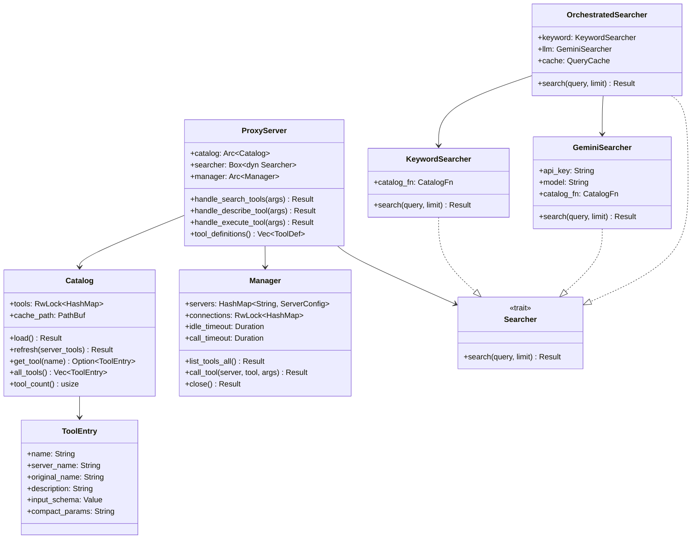
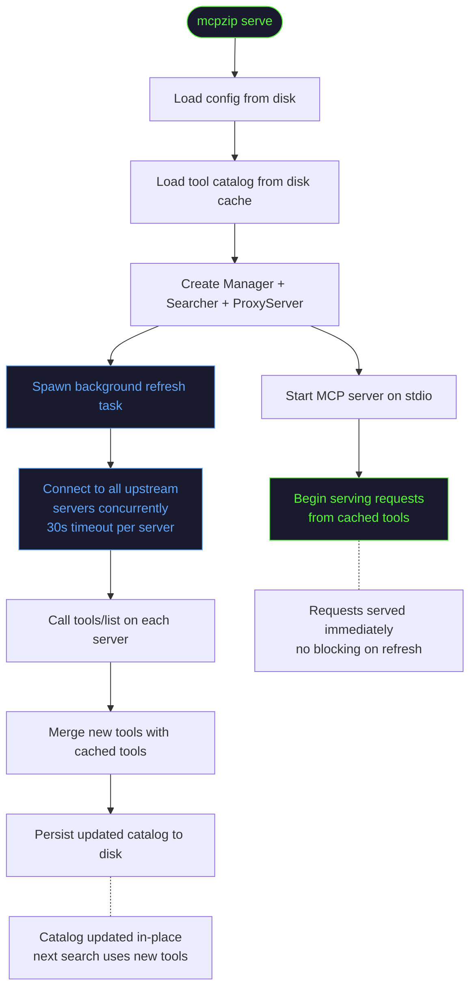
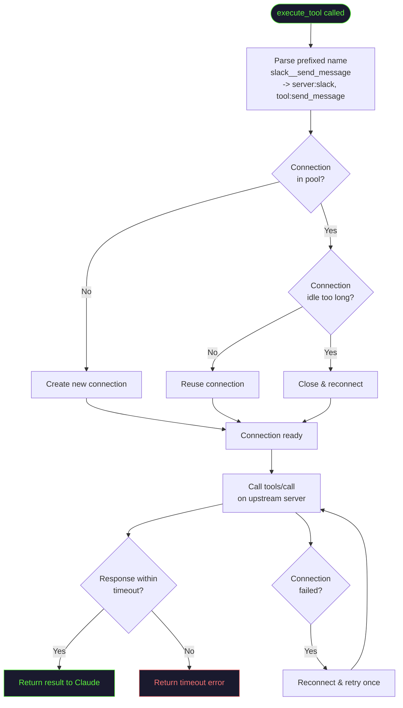
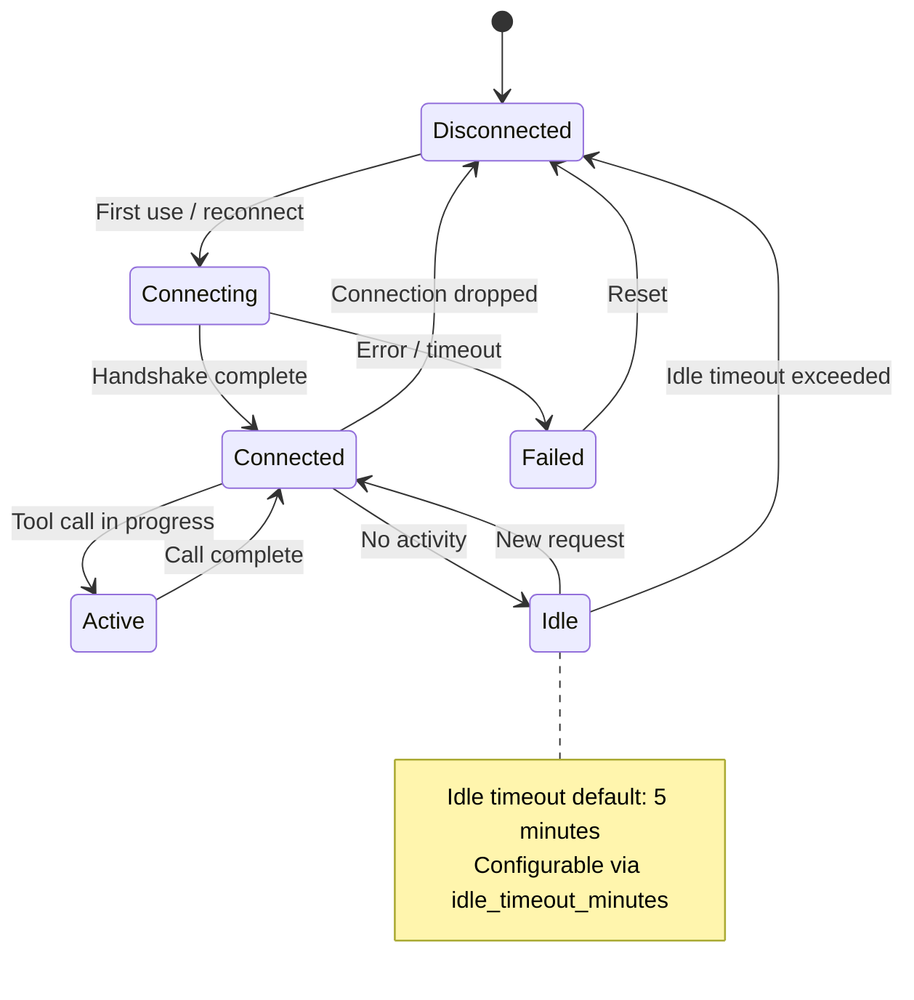
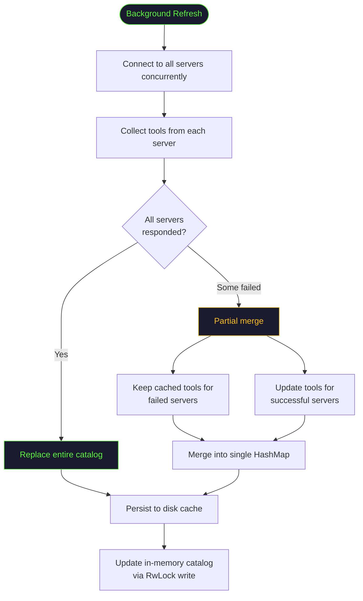

# Internals

A deep dive into mcpzip's internal architecture, data flow, and algorithms. This page is for contributors and curious engineers who want to understand how the proxy works under the hood.

## Core Types



<details>
<summary><strong>What is Arc and RwLock?</strong></summary>

These are Rust concurrency primitives:

- **`Arc<T>`** (Atomic Reference Counted) -- a thread-safe smart pointer that allows shared ownership of a value. Multiple parts of the code can hold a reference to the same data.
- **`RwLock<T>`** (Read-Write Lock) -- allows multiple concurrent readers OR a single writer. The catalog uses this so searches can read concurrently while background refresh can write.

Together, `Arc<RwLock<HashMap>>` gives mcpzip a thread-safe, concurrent tool catalog.

</details>

## Startup Sequence



:::info Non-Blocking Startup
The key insight is that mcpzip serves from cache **immediately**. The background refresh runs concurrently and updates the catalog in-place. This means:
- First request is served in <1ms (from cache)
- No startup delay even if upstream servers are slow
- If a server is down, its cached tools are preserved
:::

## Tool Call Lifecycle



## Connection Pool State Machine

Each upstream server connection follows this state machine:



### Connection Pool Internals

| Property | Value | Configurable |
|----------|-------|-------------|
| Default idle timeout | 5 minutes | `idle_timeout_minutes` |
| Default call timeout | 120 seconds | `call_timeout_seconds` |
| Concurrent list_tools timeout | 30 seconds per server | No |
| Reconnection strategy | Automatic on next use | No |
| Max concurrent connections | Unlimited (one per server) | No |

## Catalog Refresh Merge Algorithm

When the background refresh completes, mcpzip merges the new tool data with the existing cache. This is a carefully designed algorithm to handle partial failures:



### Why Partial Merge?

Consider this scenario:

1. You have 5 servers configured: Slack, GitHub, Todoist, Gmail, Linear
2. On startup, mcpzip loads 250 cached tools
3. Background refresh connects to all 5 servers
4. Todoist is temporarily down (network error)
5. The other 4 servers respond with their tools

**Without partial merge**: You'd lose all Todoist tools until the next refresh.

**With partial merge**: Todoist's cached tools are preserved. The catalog stays complete with all 250 tools, with 4 servers' tools freshly updated.

:::tip
This is why mcpzip always serves from cache first. Even if every upstream server is down, the cached catalog ensures Claude can still search and describe tools (though `execute_tool` would fail).
:::

## Tool Name Convention

Tools are namespaced as `{server}__{tool}`, using double underscore as a separator:

```
slack__send_message
todoist__create_task
gmail-personal__send_email
```

**Why double underscore?**

| Separator | Problem |
|-----------|---------|
| Single `_` | Common in tool names (`send_message`) |
| `.` | Used in namespaces, can confuse parsers |
| `/` | URL separator, can break routing |
| `::` | Language-specific (Rust, C++) |
| `__` | Rare in tool names, easy to split on first occurrence |

The split happens on the **first** `__` occurrence. So a tool named `a__b__c` resolves to server `a`, tool `b__c`.

## Project Structure

```
src/
  main.rs              Entry point, CLI dispatch
  lib.rs               Module declarations
  config.rs            Config loading, validation, paths
  error.rs             Error types (McpzipError enum)
  types.rs             Core types: ToolEntry, ServerConfig, ProxyConfig

  cli/
    mod.rs             CLI definition (clap)
    serve.rs           serve command, MCP server setup
    init.rs            Interactive setup wizard
    migrate.rs         Claude Code config migration

  auth/
    mod.rs             Module declarations
    oauth.rs           OAuth 2.1 handler (PKCE, browser flow)
    store.rs           Token persistence (disk storage)

  proxy/
    mod.rs             Module declarations
    server.rs          ProxyServer: meta-tool handlers
    handlers.rs        search/describe/execute implementation

  catalog/
    mod.rs             Module declarations
    catalog.rs         Catalog: tool storage, disk cache, refresh

  search/
    mod.rs             Module declarations + factory function
    keyword.rs         KeywordSearcher: tokenization, scoring
    gemini.rs          GeminiSearcher: LLM-powered search
    orchestrator.rs    OrchestratedSearcher: merge + cache
    cache.rs           QueryCache: normalized query caching

  transport/
    mod.rs             Module declarations + Upstream trait
    manager.rs         Manager: connection pool
    stdio.rs           StdioUpstream: process spawning, NDJSON
    http.rs            HttpUpstream: Streamable HTTP, SSE, OAuth
    sse.rs             SseUpstream: legacy SSE transport

  mcp/
    mod.rs             Module declarations
    protocol.rs        MCP protocol types (JSON-RPC, tool schemas)
    server.rs          McpServer: NDJSON stdio server
    transport.rs       McpTransport trait, NdjsonTransport
```

## Memory Layout

At runtime, mcpzip's memory is organized as:

| Component | Typical Size | Notes |
|-----------|-------------|-------|
| Tool catalog | 2-5 MB | Depends on tool count and schema sizes |
| Connection pool | 1-2 MB per active connection | stdio processes have their own memory |
| Query cache | <1 MB | Bounded by unique queries |
| Base runtime | ~8 MB | Tokio runtime, MCP server, etc. |
| **Total (idle)** | **~15 MB** | With cached catalog, no active connections |

:::note
stdio connections (spawned processes) run as separate OS processes with their own memory. The figures above are for mcpzip itself, not the upstream servers it manages.
:::
