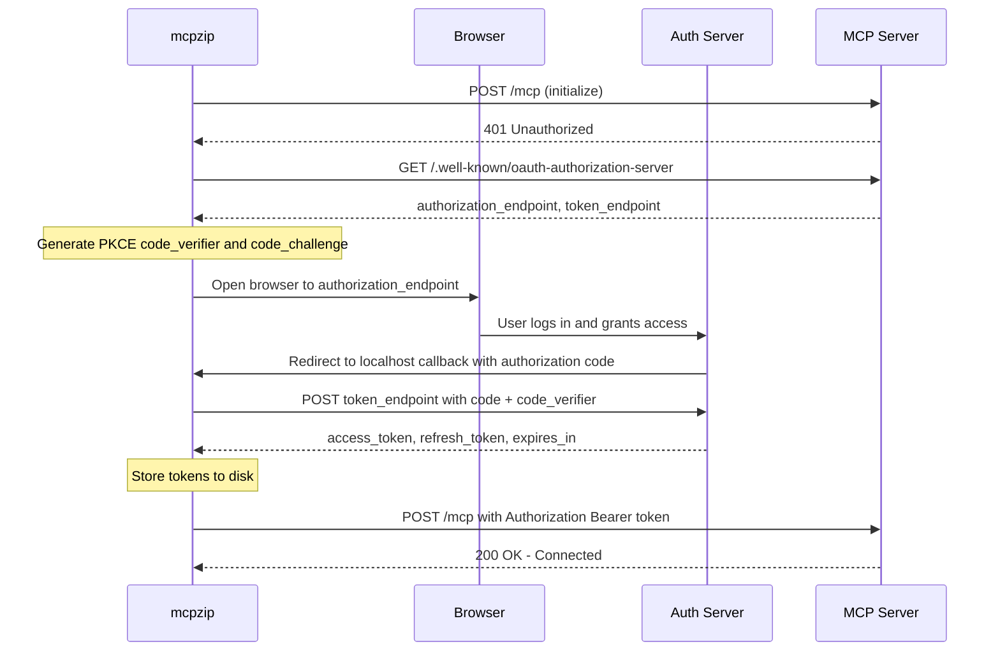
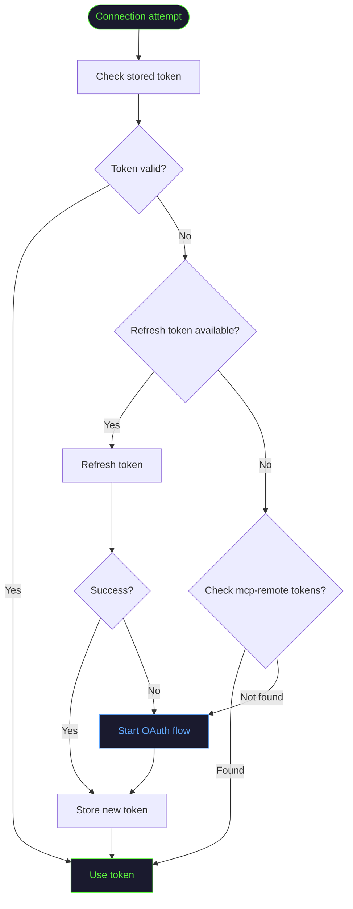

# OAuth

mcpzip automatically handles OAuth 2.1 authentication for remote HTTP MCP servers. No manual token management required.

## When OAuth is Used

OAuth is triggered when **all** of these conditions are met:

1. The server has `type: "http"`
2. No custom `headers` are configured
3. The server responds with `401 Unauthorized`

If you set `headers` (e.g., for API key auth), OAuth is completely skipped.

:::info
Setting custom headers is the escape hatch. If a server has a simpler auth mechanism (API key, pre-shared token), put it in `headers` and OAuth will not activate.
:::

<details>
<summary><strong>What is OAuth 2.1?</strong></summary>

**OAuth 2.1** is an authorization framework that lets applications access resources on behalf of a user without handling their password directly.

Key concepts:
- **Authorization Server** -- issues access tokens after user grants permission
- **Resource Server** -- the MCP server that requires authentication
- **Client** -- mcpzip, acting on behalf of the user
- **Access Token** -- short-lived credential for API access
- **Refresh Token** -- long-lived credential used to obtain new access tokens

OAuth 2.1 is an evolution of OAuth 2.0 that mandates PKCE, prohibits implicit grants, and tightens security requirements.

</details>

<details>
<summary><strong>What is PKCE?</strong></summary>

**PKCE** (Proof Key for Code Exchange, pronounced "pixy") prevents authorization code interception attacks.

How it works:
1. mcpzip generates a random **code verifier** (a long random string)
2. It creates a **code challenge** by hashing the verifier with SHA-256
3. The code challenge is sent in the authorization request
4. When exchanging the auth code for tokens, mcpzip sends the original code verifier
5. The authorization server verifies that the verifier matches the challenge

This ensures that even if an attacker intercepts the authorization code, they cannot exchange it for tokens without the original code verifier.

</details>

## The OAuth Flow



## Token Storage

Tokens are persisted to disk at:

```
~/.config/compressed-mcp-proxy/auth/{hash}.json
```

The `{hash}` is derived from the server URL, so each server gets its own token file.

| Field | Description |
|-------|-------------|
| `access_token` | Current access token |
| `refresh_token` | Token used to obtain new access tokens |
| `expires_at` | Expiration timestamp |
| `token_type` | Usually `"Bearer"` |

:::warning File Permissions
Token files contain sensitive credentials. Set restrictive permissions:

```bash
chmod 700 ~/.config/compressed-mcp-proxy/auth/
chmod 600 ~/.config/compressed-mcp-proxy/auth/*.json
```
:::

## Token Reuse

### Across Restarts

Tokens persist on disk, so restarting mcpzip does not require re-authentication.



### From mcp-remote

mcpzip checks for tokens previously saved by `mcp-remote` (the reference MCP OAuth client). If you have already authenticated with a server using mcp-remote, mcpzip will reuse those tokens.

## Troubleshooting

<details>
<summary><strong>Browser does not open</strong></summary>

If the browser does not open automatically:

1. Check the terminal output -- mcpzip prints the authorization URL
2. Copy the URL and open it manually in your browser
3. On headless systems, use API key auth via `headers` instead

</details>

<details>
<summary><strong>Token expired, getting 401 errors</strong></summary>

Clear cached tokens and restart:

```bash
rm ~/.config/compressed-mcp-proxy/auth/*.json
```

mcpzip will trigger a fresh OAuth flow on next connection.

</details>

<details>
<summary><strong>Callback server fails to start</strong></summary>

mcpzip runs a temporary local HTTP server to receive the OAuth callback. If port binding fails:

1. Check if another process is using the port
2. Try again -- mcpzip uses a dynamic port, so conflicts are rare

</details>

<details>
<summary><strong>"Invalid redirect_uri" error</strong></summary>

This usually means the OAuth application's registered redirect URIs do not match what mcpzip is using. This is a server-side issue -- contact the MCP server provider.

</details>

<details>
<summary><strong>Multiple servers needing OAuth</strong></summary>

Each server maintains its own token independently. If you have 3 OAuth-authenticated servers, you will go through the browser flow 3 times on first use. After that, tokens are reused from disk.

</details>
