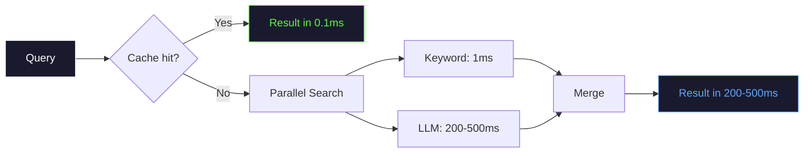
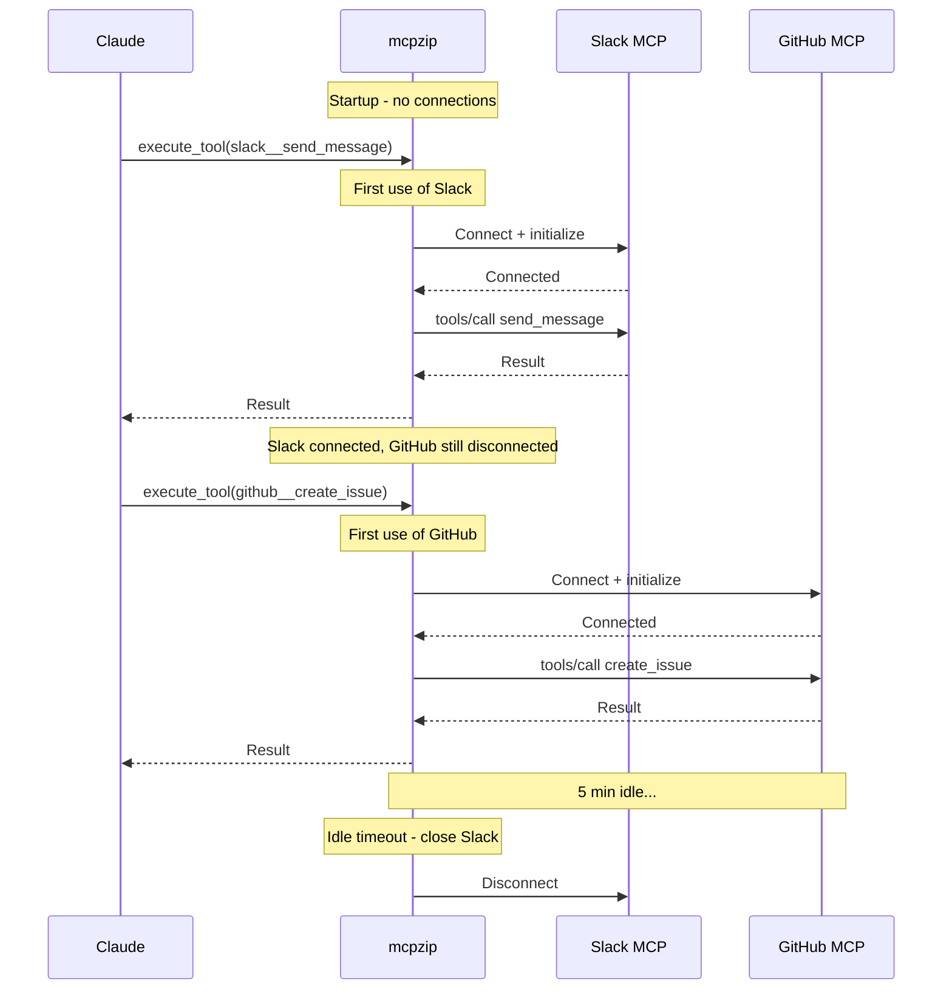

import TokenSavingsCalculator from '@site/src/components/TokenSavingsCalculator';
import ComparisonTable from '@site/src/components/ComparisonTable';

# Performance

mcpzip is designed to be fast and lightweight. This page covers the performance characteristics you can expect.

## Context Window Savings

The primary benefit of mcpzip is **context window compression**.

| Metric | Without mcpzip | With mcpzip |
|--------|---------------|-------------|
| Tool schemas loaded | All (N) | 3 (always) |
| Tokens per tool schema | ~350 | ~400 (meta-tool) |
| Total tool tokens (10 servers, 50 tools each) | ~175,000 | ~1,200 |
| Context overhead | **87.5%** of 200K | **0.6%** of 200K |
| Savings | -- | **99.3%** |

<strong>How does context window compression work?</strong>

Every MCP tool has a **JSON Schema** that describes its parameters. This schema is sent to the AI model in every message as part of the "tool definitions" block.

A typical tool schema consumes ~350 tokens. With 500 tools, that is **175,000 tokens** consumed before your conversation starts.

mcpzip replaces all of those with 3 meta-tools (~1,200 tokens total). When Claude needs a tool, it searches on demand and loads only the schema it needs.

### Interactive Calculator

Adjust the sliders to see how many tokens mcpzip saves for your setup:

<TokenSavingsCalculator />

### Real-World Scenarios

<ComparisonTable
  headers={["Scenario", "Without mcpzip", "With mcpzip"]}
  rows={[
    ["Small setup (3 servers, 30 tools)", "10,500 tokens", "1,200 tokens"],
    ["Medium setup (5 servers, 125 tools)", "43,750 tokens", "1,200 tokens"],
    ["Large setup (10 servers, 500 tools)", "175,000 tokens", "1,200 tokens"],
    ["Power user (15 servers, 900 tools)", "315,000 tokens", "1,200 tokens"],
  ]}
/>

:::danger Context Window Exhaustion
With 15+ MCP servers loaded directly, the tool schemas alone can exceed the context window of many models. GPT-4 starts degrading past ~60 tools. mcpzip eliminates this problem entirely.
:::

## Startup Time

```mermaid
gantt
    title Startup Timeline
    dateFormat X
    axisFormat %Lms

    section Without mcpzip
    Connect to Server 1           :a1, 0, 2000
    Connect to Server 2           :a2, 0, 3000
    Connect to Server 3           :a3, 0, 1500
    Connect to Server 4           :a4, 0, 4000
    Connect to Server 5           :a5, 0, 2500
    List tools (all)              :a6, after a4, 500
    Ready to serve                :milestone, after a6, 0

    section With mcpzip
    Load disk cache               :b1, 0, 5
    Ready to serve                :milestone, after b1, 0
    Background refresh (async)    :b2, after b1, 4000
```

| Phase | Without mcpzip | With mcpzip |
|-------|---------------|-------------|
| Time to first request | 2-10 seconds | **< 5 milliseconds** |
| Background refresh | N/A | 2-10 seconds (non-blocking) |
| Catalog available | After all servers connect | **Immediately** (from cache) |

:::tip Instant Start
mcpzip's disk cache means it is ready to serve within milliseconds. The background refresh updates the catalog without blocking any requests.
:::

## Search Latency

| Search Type | Latency | When Used |
|-------------|---------|-----------|
| Cache hit | **< 0.1ms** | Repeated or similar queries |
| Keyword search | **< 1ms** | Always (parallel with LLM) |
| LLM search (Gemini) | **200-500ms** | When `gemini_api_key` is set |
| Combined (cache miss) | **200-500ms** | First search with LLM enabled |

## Memory Usage

| State | Memory |
|-------|--------|
| Idle (cached catalog loaded) | ~15 MB |
| Active (5 stdio connections) | ~20 MB + child processes |
| Active (5 HTTP connections) | ~18 MB |
| Peak (catalog refresh) | ~25 MB |

:::note
stdio connections spawn child processes. Those processes have their own memory usage, typically 30-100MB each depending on the MCP server implementation. mcpzip itself stays lean.
:::

## Binary Size

| Build | Size |
|-------|------|
| mcpzip (Rust, release) | **5.8 MB** |
| Previous Go version | 11 MB |
| Typical Node.js MCP server | 50-200 MB (with node_modules) |

The Rust binary is statically linked with no runtime dependencies.

## Connection Pooling

| Feature | Behavior |
|---------|----------|
| Connection strategy | Lazy (connect on first use) |
| Idle timeout | 5 minutes (configurable) |
| Reconnection | Automatic on next request |
| Concurrent startup | All servers connect in parallel |
| Per-server timeout | 30 seconds during catalog refresh |
| Call timeout | 120 seconds (configurable) |

