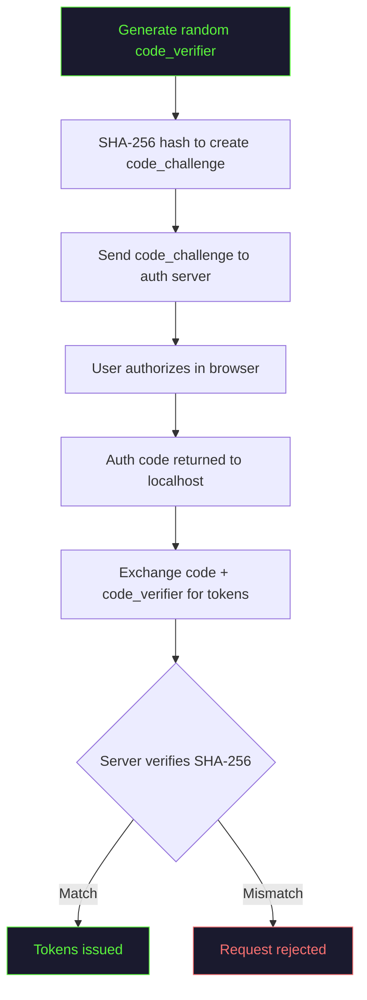
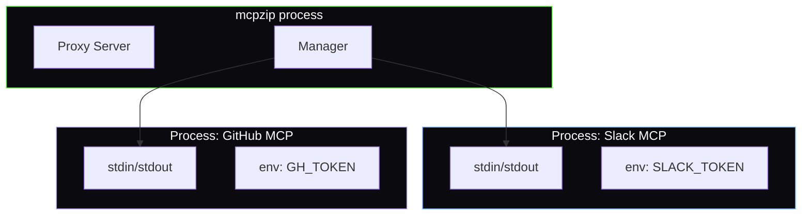

# Security

mcpzip handles OAuth tokens, API keys, and MCP server credentials. Here is how it keeps them safe.

## Credential Storage

### Config File

Your main config at `~/.config/compressed-mcp-proxy/config.json` may contain API keys and tokens.

:::danger Protect Your Config File

```bash
chmod 600 ~/.config/compressed-mcp-proxy/config.json
```

Never commit this file to version control.
:::

### OAuth Tokens

Stored at `~/.config/compressed-mcp-proxy/auth/{hash}.json`, where the hash is derived from the server URL.

```bash
chmod 700 ~/.config/compressed-mcp-proxy/auth/
chmod 600 ~/.config/compressed-mcp-proxy/auth/*.json
```

### Tool Cache

The cache at `~/.config/compressed-mcp-proxy/cache/tools.json` contains tool names, descriptions, and parameter schemas. It does **not** contain credentials or user data.

## File Permission Summary

| Path | Contains Secrets | Recommended |
|------|-----------------|-------------|
| `config.json` | Yes (API keys, tokens) | `600` |
| `auth/*.json` | Yes (OAuth tokens) | `600` |
| `auth/` | Directory | `700` |
| `cache/tools.json` | No | `644` |

## OAuth Security

mcpzip implements OAuth 2.1 with these security measures:

| Feature | Description |
|---------|-------------|
| **PKCE** | Proof Key for Code Exchange prevents code interception |
| **Code verifier** | 128-character random string, never transmitted |
| **State parameter** | Prevents CSRF attacks on the callback |
| **Localhost callback** | Runs on localhost only, not externally accessible |
| **Dynamic port** | Random available port to avoid conflicts |
| **TLS** | Token exchange happens over HTTPS |



:::info Why PKCE Matters
Without PKCE, an attacker who intercepts the authorization code could exchange it for tokens. With PKCE, the code is useless without the original code verifier, which never leaves mcpzip's process memory.
:::

## Process Isolation

Each stdio upstream server runs as a separate OS process:

- Processes are isolated from each other
- Each process gets only its own `env` variables
- Processes are killed on mcpzip shutdown
- A compromised server process cannot access other servers' credentials



## Network Security

| Transport | Protocol | Notes |
|-----------|----------|-------|
| stdio | Local pipes | No network traffic |
| HTTP | HTTPS (TLS 1.2+) | System certificate store |
| SSE | HTTPS | Same as HTTP |

## Reporting Vulnerabilities

If you discover a security vulnerability:

1. **Do not** open a public GitHub issue
2. Email security concerns to the [Hypercall team](https://hypercall.xyz)
3. We will acknowledge within 48 hours
